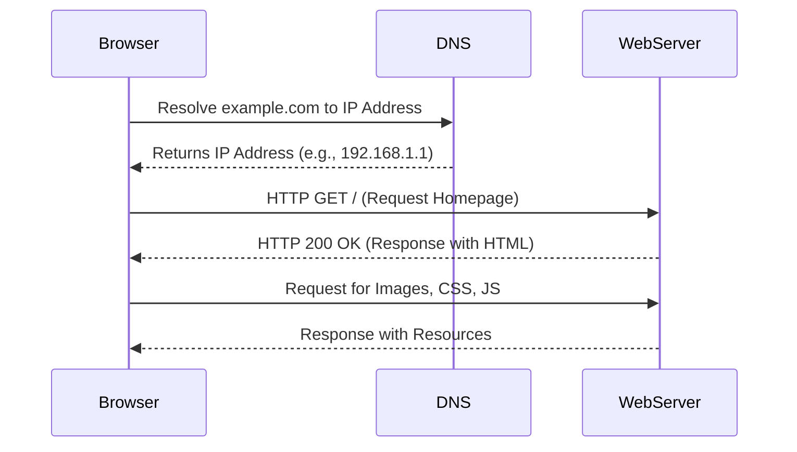
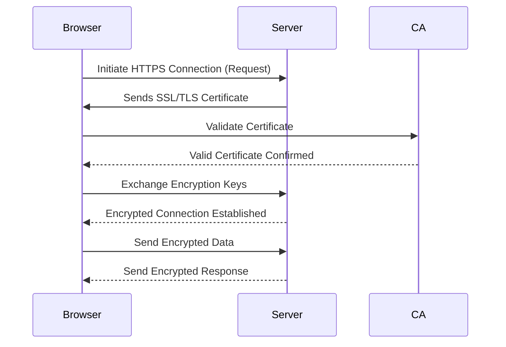
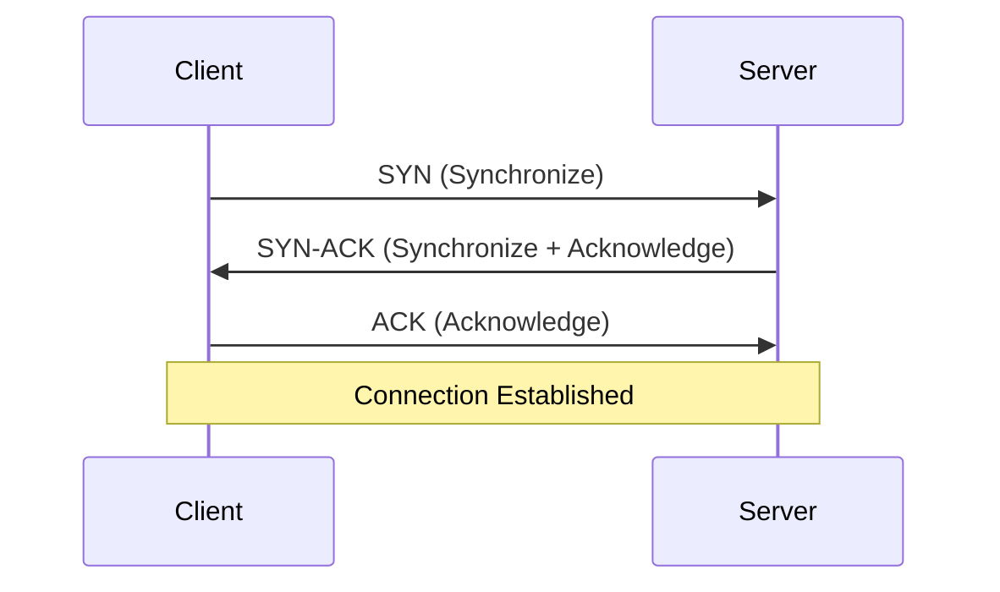
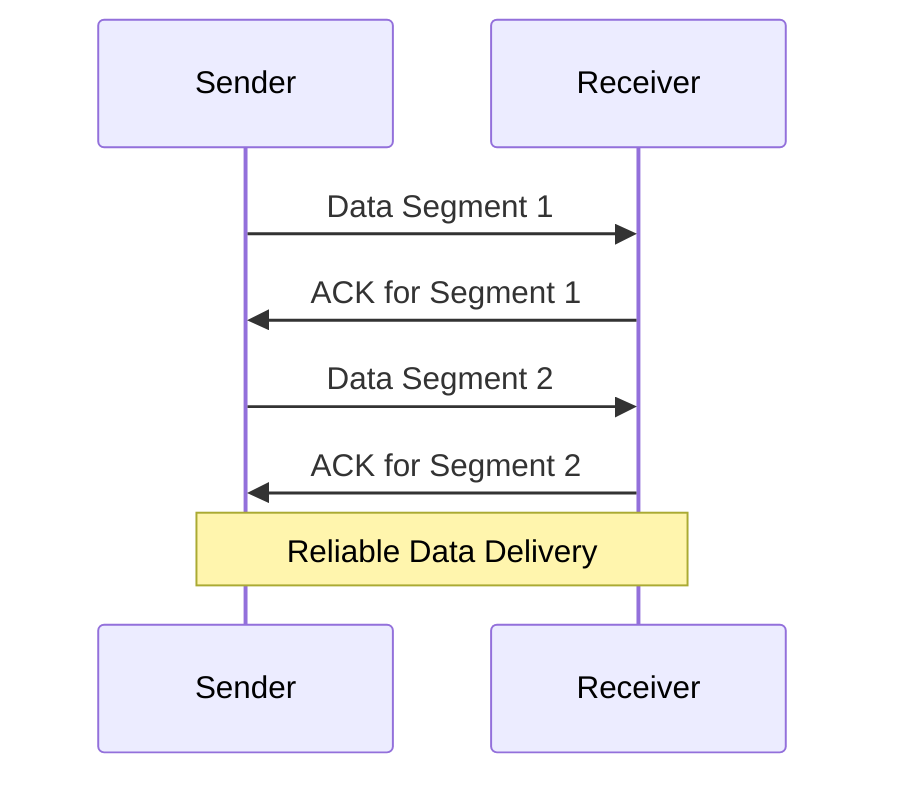
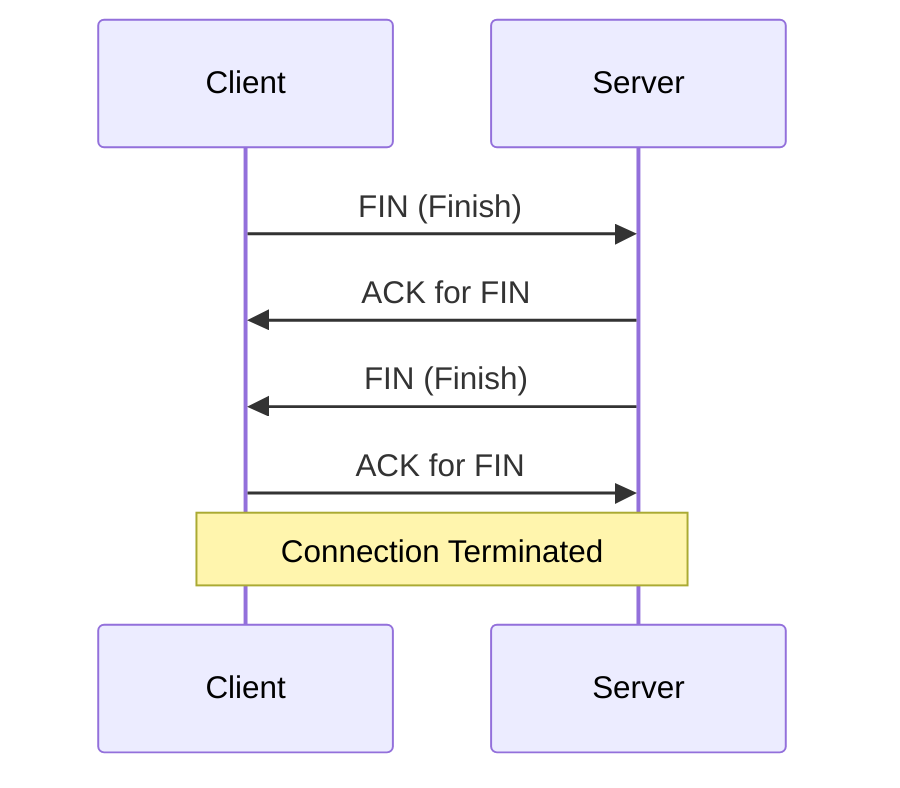

# Communication Protocols

# 1. HTTP (Hypertext Transfer Protocol)

## What is HTTP?

- **Definition**: HTTP (Hypertext Transfer Protocol) is a communication protocol used to transfer data such as HTML, CSS, JavaScript, images, and other web resources between a client (browser) and a server.
- **Type**: It is a stateless, application-layer protocol.
- **Port**: HTTP typically operates on **port 80**.
- **Protocol Version**: Common versions include:
  - **HTTP/1.1**: Most widely used with persistent connections.
  - **HTTP/2**: Introduced multiplexing and compression.
  - **HTTP/3**: Uses UDP with enhanced speed and security.

---

## Why is HTTP Important?

1. **Foundation of the Web**: HTTP powers the web, enabling browsers to communicate with servers seamlessly.
2. **Platform Independent**: It works universally across devices and operating systems.
3. **Ease of Use**: Provides a simple structure for exchanging requests and responses.
4. **Supports Caching**: Improves performance by allowing resources to be reused.
5. **Flexibility in Methods**:
   - **GET**: Retrieve data (e.g., fetching a webpage).
   - **POST**: Send data to the server (e.g., submitting a form).
   - **PUT**: Update data on the server.
   - **DELETE**: Remove a resource.

---

## When is HTTP Used?

- **Accessing Websites**: Anytime you type a URL (e.g., `http://example.com`) in your browser.
- **RESTful APIs**: HTTP is widely used in API communication to exchange data between systems.
- **File Downloads**: HTTP allows files such as PDFs, images, or documents to be downloaded from the server.
- **Sending Form Data**: Login, registration, or any form submission involves HTTP.

---

## Where Does HTTP Operate?

- **Browser to Web Server**: Facilitates communication between a user’s browser and a web application.
- **Application to Application**: Used for data transfer between APIs.
- **Local Development**: Developers use HTTP servers for testing and debugging locally.

---

## How HTTP Works

### Step-by-Step Process:

1. **DNS Resolution**:
   - The client (browser) converts the domain name (e.g., `example.com`) into an IP address using DNS.
2. **TCP Handshake**:
   - A reliable connection is established between the client and server using the **Transmission Control Protocol (TCP)**.
3. **Client Sends Request**:
   - The browser sends an HTTP request to the server, specifying:
     - HTTP method (e.g., GET, POST).
     - Target resource (e.g., `/home`).
4. **Server Processes Request**:
   - The server interprets the request, retrieves the required resource, and sends back an HTTP response.
5. **Client Receives Response**:
   - The browser renders the received data (e.g., HTML, CSS, JavaScript) to display the requested page.

---

## Scenario: Visiting a Website Using HTTP

### Real-Life Example

You open your browser and type `http://example.com` into the address bar.

1. **Request**:
   - The browser sends an HTTP `GET` request to the server asking for the homepage.
2. **Response**:
   - The server processes the request and sends back the HTML, CSS, and JavaScript needed for the homepage.
3. **Rendering**:
   - The browser displays the website using the received data.

### Key Takeaways:

- **Stateless Nature**:
  - HTTP does not retain memory of previous requests or interactions.
- **Request Methods in Action**:
  - `GET`: To fetch the homepage.
  - `POST`: To submit data (e.g., login details).

---

## Visualization: How HTTP Works

-----
# 2. HTTPS (Hypertext Transfer Protocol Secure)

## What is HTTPS?

- **Definition**: HTTPS is the secure version of HTTP. It uses encryption (via SSL/TLS) to secure the communication between the client and server, ensuring confidentiality, integrity, and authenticity of the data.
- **Type**: Application-layer protocol, secure by design.
- **Port**: HTTPS operates on **port 443** (default).
- **Encryption Standard**: Uses **SSL/TLS** for encryption.

---

## Why is HTTPS Important?

1. **Data Security**:
   - Encrypts sensitive data (e.g., passwords, credit card information) to prevent interception.
2. **Trust and Credibility**:
   - Browsers display a padlock icon, indicating a secure website.
3. **SEO Benefits**:
   - Search engines like Google prioritize HTTPS websites in rankings.
4. **Prevents Attacks**:
   - Protects against **Man-in-the-Middle (MitM)** attacks by ensuring secure connections.
5. **Complies with Regulations**:
   - Meets security requirements for GDPR, PCI DSS, etc.

---

## When is HTTPS Used?

- **E-Commerce Websites**: For secure transactions involving payment details.
- **Banking Applications**: To protect sensitive financial data.
- **Social Media**: To safeguard personal information during login and interactions.
- **APIs**: For secure communication between applications.
- **Corporate Websites**: To protect proprietary data and maintain brand trust.

---

## Where Does HTTPS Operate?

- **Between Browsers and Servers**: To encrypt web traffic (e.g., a user visiting an online store).
- **API Communication**: Ensures secure data exchange between back-end services.
- **Mobile Applications**: For secure transactions and user authentication.

---

## How HTTPS Works

### Step-by-Step Process:

1. **Client Requests HTTPS Connection**:
   - The browser sends a request to establish a secure connection to the server.
2. **SSL/TLS Handshake**:
   - The client and server exchange encryption keys to establish a secure session.
3. **Certificate Verification**:
   - The server provides an SSL/TLS certificate, which the browser verifies against trusted Certificate Authorities (CAs).
4. **Secure Data Exchange**:
   - All subsequent communication is encrypted, ensuring privacy and integrity.

---

## Scenario: Making a Payment Online Using HTTPS

### Real-Life Example

1. **User Action**:
   - You enter your credit card details on an e-commerce website.
2. **Secure Connection**:
   - The browser establishes an HTTPS connection with the server.
3. **Encrypted Data**:
   - Your payment details are encrypted before being sent to the server.
4. **Server Processing**:
   - The server decrypts the data, processes the payment, and sends a confirmation response.

### Key Takeaways:

- **Encryption in Action**:
  - Prevents attackers from intercepting sensitive payment details.
- **Trust**:
  - The padlock icon reassures users of a secure transaction.

---

## Visualization: How HTTPS Works

---
# TCP (Transmission Control Protocol)

## What is TCP?

- **Definition**: TCP is a connection-oriented communication protocol used for reliable transmission of data over the internet. It ensures that all packets arrive, in order, without errors.
- **Type**: Transport-layer protocol.
- **Port**: Uses various ports (e.g., 80 for HTTP, 443 for HTTPS).
- **Key Features**:
  - Connection-oriented.
  - Reliable, with acknowledgment of data receipt.
  - Data is transmitted in segments, reassembled at the destination.

---

## Why is TCP Important?

1. **Reliability**:
   - Ensures data reaches its destination accurately and in sequence.
2. **Error Handling**:
   - Retransmits lost or corrupted data packets.
3. **Ordered Delivery**:
   - Guarantees the order of data packets, critical for applications like file transfers.
4. **Widely Used**:
   - Foundation for protocols like HTTP, HTTPS, FTP, and SMTP.

---

## When is TCP Used?

- **Web Browsing**: To load websites securely and reliably (via HTTP/HTTPS).
- **File Transfers**: For large files using FTP.
- **Email Delivery**: Ensures messages are sent and received correctly (via SMTP).
- **Remote Access**: Used in SSH and Telnet for secure connections.

---

## Where Does TCP Operate?

- TCP operates at the **Transport Layer** of the OSI model.
- It acts as an intermediary between the **application layer** (e.g., HTTP) and the **network layer** (IP).

---

## How TCP Works

### Step-by-Step Process:

1. **Connection Establishment**:
   - Uses a **three-way handshake** to establish a connection.
   - Both sender and receiver agree on initial sequence numbers.
2. **Data Transmission**:
   - Data is divided into segments and sent.
   - Each segment is acknowledged by the receiver.
3. **Error Handling**:
   - Lost or corrupted segments are retransmitted.
4. **Connection Termination**:
   - Uses a **four-step process** to safely close the connection.

---

## Scenario: Downloading a File

### Real-Life Example

1. **Request Initiation**:
   - You click "Download" on a website.
2. **Connection Established**:
   - TCP establishes a reliable connection between your browser and the server.
3. **Data Transmission**:
   - The server sends the file in segments.
   - TCP ensures all segments are received and reassembled in the correct order.
4. **File Completion**:
   - Once the download is complete, TCP closes the connection.

---

## Visualization: How TCP Works

### Three-Way Handshake

