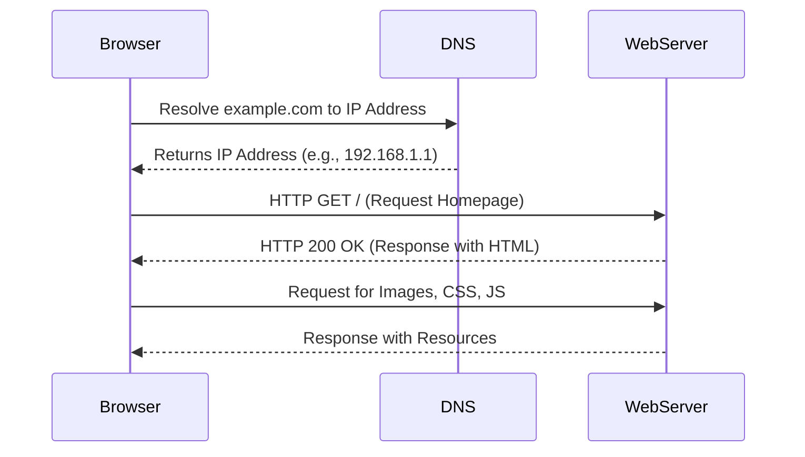
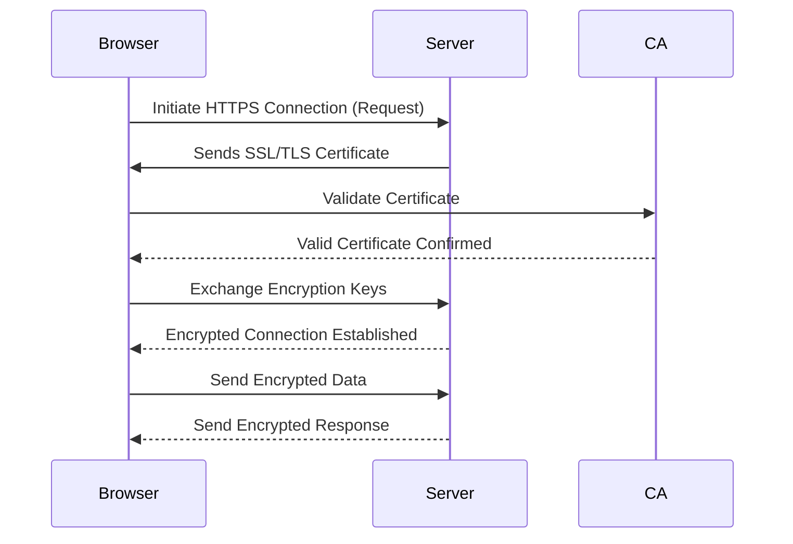
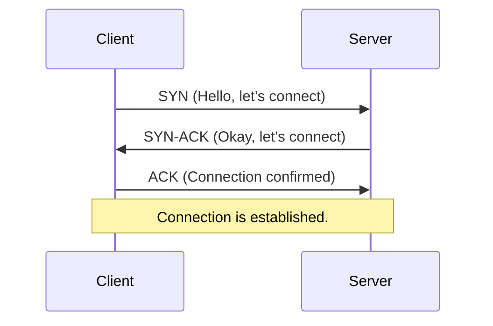
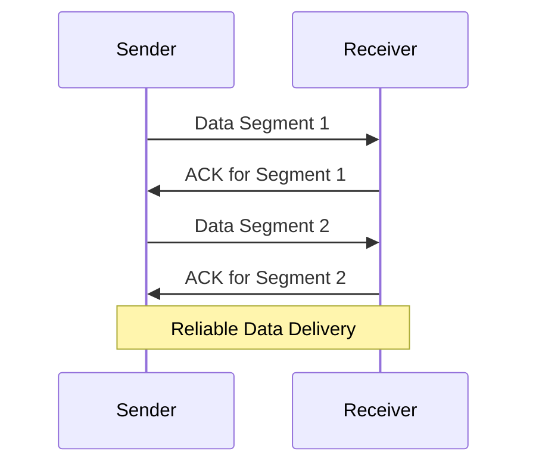
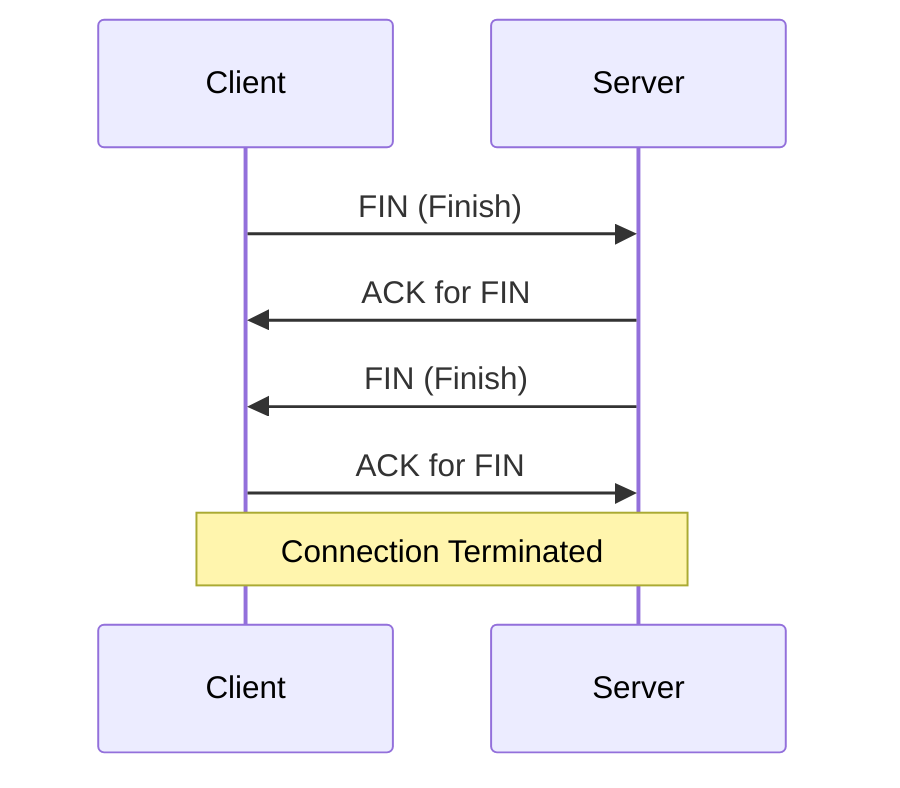
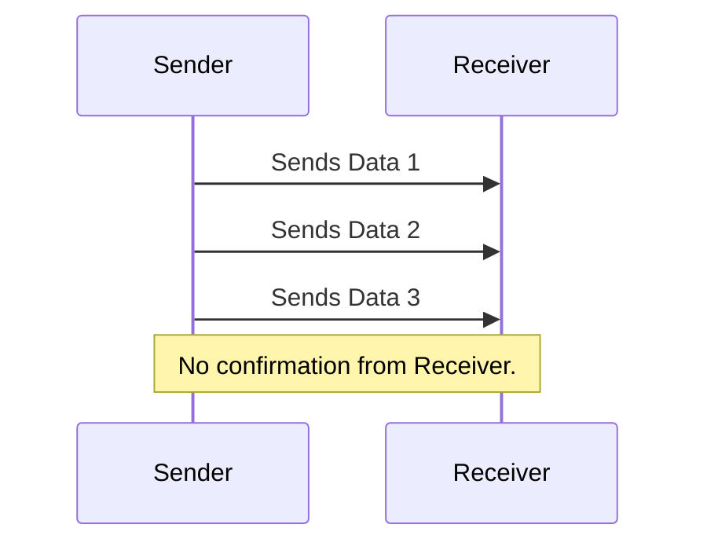
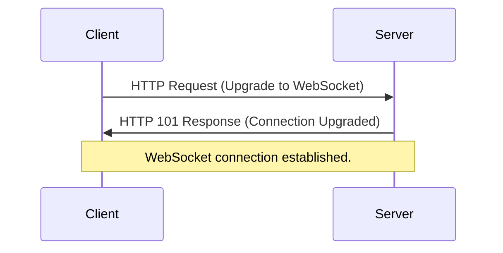

# Communication Protocols

# 1. HTTP (Hypertext Transfer Protocol)

## What is HTTP?

- **Definition**: HTTP (Hypertext Transfer Protocol) is a communication protocol used to transfer data such as HTML, CSS, JavaScript, images, and other web resources between a client (browser) and a server.
- **Type**: It is a stateless, application-layer protocol.
- **Port**: HTTP typically operates on **port 80**.
- **Protocol Version**: Common versions include:
  - **HTTP/1.1**: Most widely used with persistent connections.
  - **HTTP/2**: Introduced multiplexing and compression.
  - **HTTP/3**: Uses UDP with enhanced speed and security.

---

## Why is HTTP Important?

1. **Foundation of the Web**: HTTP powers the web, enabling browsers to communicate with servers seamlessly.
2. **Platform Independent**: It works universally across devices and operating systems.
3. **Ease of Use**: Provides a simple structure for exchanging requests and responses.
4. **Supports Caching**: Improves performance by allowing resources to be reused.
5. **Flexibility in Methods**:
   - **GET**: Retrieve data (e.g., fetching a webpage).
   - **POST**: Send data to the server (e.g., submitting a form).
   - **PUT**: Update data on the server.
   - **DELETE**: Remove a resource.

---

## When is HTTP Used?

- **Accessing Websites**: Anytime you type a URL (e.g., `http://example.com`) in your browser.
- **RESTful APIs**: HTTP is widely used in API communication to exchange data between systems.
- **File Downloads**: HTTP allows files such as PDFs, images, or documents to be downloaded from the server.
- **Sending Form Data**: Login, registration, or any form submission involves HTTP.

---

## Where Does HTTP Operate?

- **Browser to Web Server**: Facilitates communication between a user’s browser and a web application.
- **Application to Application**: Used for data transfer between APIs.
- **Local Development**: Developers use HTTP servers for testing and debugging locally.

---

## How HTTP Works

### Step-by-Step Process:

1. **DNS Resolution**:
   - The client (browser) converts the domain name (e.g., `example.com`) into an IP address using DNS.
2. **TCP Handshake**:
   - A reliable connection is established between the client and server using the **Transmission Control Protocol (TCP)**.
3. **Client Sends Request**:
   - The browser sends an HTTP request to the server, specifying:
     - HTTP method (e.g., GET, POST).
     - Target resource (e.g., `/home`).
4. **Server Processes Request**:
   - The server interprets the request, retrieves the required resource, and sends back an HTTP response.
5. **Client Receives Response**:
   - The browser renders the received data (e.g., HTML, CSS, JavaScript) to display the requested page.

---

## Scenario: Visiting a Website Using HTTP

### Real-Life Example

You open your browser and type `http://example.com` into the address bar.

1. **Request**:
   - The browser sends an HTTP `GET` request to the server asking for the homepage.
2. **Response**:
   - The server processes the request and sends back the HTML, CSS, and JavaScript needed for the homepage.
3. **Rendering**:
   - The browser displays the website using the received data.

### Key Takeaways:

- **Stateless Nature**:
  - HTTP does not retain memory of previous requests or interactions.
- **Request Methods in Action**:
  - `GET`: To fetch the homepage.
  - `POST`: To submit data (e.g., login details).

---

## Visualization: How HTTP Works


-----
# 2. HTTPS (Hypertext Transfer Protocol Secure)

## What is HTTPS?

- **Definition**: HTTPS is the secure version of HTTP. It uses encryption (via SSL/TLS) to secure the communication between the client and server, ensuring confidentiality, integrity, and authenticity of the data.
- **Type**: Application-layer protocol, secure by design.
- **Port**: HTTPS operates on **port 443** (default).
- **Encryption Standard**: Uses **SSL/TLS** for encryption.

---

## Why is HTTPS Important?

1. **Data Security**:
   - Encrypts sensitive data (e.g., passwords, credit card information) to prevent interception.
2. **Trust and Credibility**:
   - Browsers display a padlock icon, indicating a secure website.
3. **SEO Benefits**:
   - Search engines like Google prioritize HTTPS websites in rankings.
4. **Prevents Attacks**:
   - Protects against **Man-in-the-Middle (MitM)** attacks by ensuring secure connections.
5. **Complies with Regulations**:
   - Meets security requirements for GDPR, PCI DSS, etc.

---

## When is HTTPS Used?

- **E-Commerce Websites**: For secure transactions involving payment details.
- **Banking Applications**: To protect sensitive financial data.
- **Social Media**: To safeguard personal information during login and interactions.
- **APIs**: For secure communication between applications.
- **Corporate Websites**: To protect proprietary data and maintain brand trust.

---

## Where Does HTTPS Operate?

- **Between Browsers and Servers**: To encrypt web traffic (e.g., a user visiting an online store).
- **API Communication**: Ensures secure data exchange between back-end services.
- **Mobile Applications**: For secure transactions and user authentication.

---

## How HTTPS Works

### Step-by-Step Process:

1. **Client Requests HTTPS Connection**:
   - The browser sends a request to establish a secure connection to the server.
2. **SSL/TLS Handshake**:
   - The client and server exchange encryption keys to establish a secure session.
3. **Certificate Verification**:
   - The server provides an SSL/TLS certificate, which the browser verifies against trusted Certificate Authorities (CAs).
4. **Secure Data Exchange**:
   - All subsequent communication is encrypted, ensuring privacy and integrity.

---

## Scenario: Making a Payment Online Using HTTPS

### Real-Life Example

1. **User Action**:
   - You enter your credit card details on an e-commerce website.
2. **Secure Connection**:
   - The browser establishes an HTTPS connection with the server.
3. **Encrypted Data**:
   - Your payment details are encrypted before being sent to the server.
4. **Server Processing**:
   - The server decrypts the data, processes the payment, and sends a confirmation response.

### Key Takeaways:

- **Encryption in Action**:
  - Prevents attackers from intercepting sensitive payment details.
- **Trust**:
  - The padlock icon reassures users of a secure transaction.

---

## Visualization: How HTTPS Works


---
# TCP (Transmission Control Protocol)

## What is TCP?

- **TCP** is a communication protocol that helps computers talk to each other reliably over the internet.
- It ensures data is sent correctly, in the right order, without missing parts.
- It’s like sending a package through a courier that guarantees safe delivery.

---

## Why is TCP Important?

- **Reliable**: Makes sure data gets to the other side without problems.
- **Error Handling**: Fixes any mistakes if data is lost or damaged.
- **Ordered Delivery**: Ensures everything arrives in the same order it was sent.

---

## When Do We Use TCP?

- **Web Browsing**: Loading websites (e.g., HTTP/HTTPS).
- **File Transfers**: Sending large files (e.g., FTP).
- **Email**: Sending emails reliably (e.g., SMTP).
- **Video Calls**: Some apps use TCP for stable communication.

---

## Where Does TCP Work?

- TCP works in the **Transport Layer** of the internet.
- It helps manage data between applications (like your browser) and networks (like the internet).

---

## How Does TCP Work?

### Steps:

1. **Starting the Connection**:
   - TCP creates a connection using a handshake (like saying “Hello” to start a call).
2. **Sending Data**:
   - Data is broken into smaller pieces called segments.
   - Each segment is checked to make sure it’s delivered correctly.
3. **Fixing Problems**:
   - If something goes wrong, TCP resends the missing data.
4. **Closing the Connection**:
   - TCP closes the connection when the communication is done.

---

## Real-Life Example: Downloading a File

1. You click "Download" on a website.
2. TCP creates a connection between your computer and the server.
3. The server sends the file in small chunks.
4. TCP makes sure every chunk arrives safely and in order.
5. When the file is fully downloaded, the connection is closed.

---

## Visualizing TCP

### Handshake: Starting the Connection


---

---

---
# UDP (User Datagram Protocol)

## What is UDP?

- **UDP** is a communication protocol used to send data quickly over the internet.
- Unlike TCP, it doesn’t check if the data arrives or if it’s in order.
- It’s like sending a postcard: once it’s sent, you don’t check if it’s delivered.

---

## Why is UDP Important?

1. **Speed**:
   - UDP is very fast because it skips extra checks.
2. **Lightweight**:
   - Uses less bandwidth and resources.
3. **Real-Time Communication**:
   - Ideal for time-sensitive tasks like video streaming or gaming.

---

## When Do We Use UDP?

- **Live Streaming**: To avoid delays while watching videos or sports online.
- **Online Gaming**: For fast communication during gameplay.
- **Video Calls**: For real-time audio and video without interruptions.
- **DNS (Domain Name System)**: Quick lookups for website addresses.

---

## Where Does UDP Work?

- UDP works in the **Transport Layer** of the internet.
- It handles data directly between applications and the network.

---

## How Does UDP Work?

### Steps:

1. **Sending Data**:
   - The sender breaks data into small packets.
   - UDP sends packets without checking if they arrive or are in order.
2. **No Feedback**:
   - The receiver doesn’t send back confirmations.
3. **Fast Delivery**:
   - Packets are delivered as quickly as possible, even if some are lost.

---

## Real-Life Example: Watching a Live Sports Stream

1. You start watching a live football match online.
2. UDP sends the video data quickly to your device.
3. If a small part of the video is lost, you won’t notice because the stream keeps playing without delay.

---

## Visualizing UDP

### Sending Data without Confirmation


----
# WebSockets

## What are WebSockets?

- **WebSockets** are a protocol used for establishing a two-way, continuous communication channel between a client (like a browser) and a server.
- Unlike HTTP, which is request-response based, WebSockets allow both the client and the server to send data to each other at any time.
- It’s like a phone call: once the connection is established, both parties can talk to each other freely without having to wait for a reply.

---

## Why are WebSockets Important?

1. **Real-Time Communication**:
   - WebSockets enable instant data exchange, making them perfect for chat apps, live notifications, or online gaming.
2. **Efficient**:
   - Once the WebSocket connection is established, data can flow in both directions without the need for repeatedly opening and closing connections.
3. **Low Latency**:
   - WebSockets provide faster data transfer compared to polling methods (where the client repeatedly asks the server for updates).

---

## When Do We Use WebSockets?

- **Chat Applications**: For real-time messaging between users.
- **Live Notifications**: For sending updates or notifications in real-time (e.g., stock prices, sports scores).
- **Online Multiplayer Games**: To exchange game data and actions between players.
- **Collaborative Tools**: For real-time collaboration on documents or whiteboards.

---

## Where Do WebSockets Work?

- WebSockets are used in the **Application Layer** and run over the same ports used by HTTP (usually port 80 for non-secure, 443 for secure connections).
- It allows continuous communication between a client (browser) and a server.

---

## How Do WebSockets Work?

### Steps:

1. **Connection Request**:
   - The client sends a special HTTP request (known as a WebSocket handshake) to the server, asking to upgrade the connection to WebSocket.
2. **Handshake Response**:
   - The server responds with an HTTP 101 status code to confirm the upgrade.
3. **Full-Duplex Communication**:
   - Once the connection is established, the client and server can send data in both directions at any time.
4. **Closing the Connection**:
   - Either the client or the server can close the WebSocket connection when it’s no longer needed.

---

## Real-Life Example: Chat Application

1. You open a chat app.
2. The client (your browser) sends a WebSocket handshake request to the server.
3. Once the server approves, the WebSocket connection is established.
4. You send a message, and it appears instantly in the chat of the other user without refreshing the page.
5. The connection stays open as long as the app is running, allowing you to receive messages instantly.

---

## Visualizing WebSockets

### Connection Establishment


---
# 1. FTP (File Transfer Protocol)

## What is FTP?

- **Definition**: FTP (File Transfer Protocol) is a standard communication protocol used to transfer files between a client and a server over a network.
- **Type**: Application-layer protocol based on TCP/IP.
- **Port**: FTP typically operates on:
  - **Port 21** for commands.
  - **Port 20** for data transfer (in active mode).
- **Modes**:
  - **Active Mode**: The client opens a port and waits for the server to connect.
  - **Passive Mode**: The server opens a port for the client to connect, improving compatibility with firewalls.

---

## Why is FTP Important?

1. **File Management**: Facilitates uploading, downloading, renaming, and deleting files on remote servers.
2. **Platform Independence**: Works across different operating systems and environments.
3. **Batch Transfers**: Supports transferring multiple files simultaneously.
4. **Large File Support**: Handles large file transfers efficiently.
5. **Automation**: Can be scripted for regular tasks like backups.

---

## When is FTP Used?

- **Website Hosting**: Uploading and maintaining files on web servers.
- **Data Sharing**: Securely transferring files between organizations.
- **Backups**: Automating backups to a remote server.
- **Legacy Systems**: Interacting with older systems reliant on FTP.

---

## Where Does FTP Operate?

- **Client-Server Architecture**:
  - The client (e.g., FileZilla, WinSCP) communicates with an FTP server.
- **Web Hosting Platforms**: Hosting services often provide FTP access.
- **Corporate Networks**: For internal file transfers and backups.
- **Remote Servers**: Managing files in cloud or on-premises environments.

---

## How FTP Works

### Step-by-Step Process:

1. **Connection Establishment**:
   - The client connects to the server using the server's address, port (21), and credentials.
2. **Command Exchange**:
   - The client sends FTP commands (e.g., `PUT`, `GET`) to manage files.
3. **File Transfer**:
   - Files are uploaded or downloaded between the client and server using a separate data connection.
4. **Session Termination**:
   - The client sends a `QUIT` command to end the session.

---

## Scenario: Using FTP to Upload a File

### Real-Life Example

You want to upload a website file to a server.

1. **Step 1: Connect to the Server**
   - Open an FTP client (e.g., FileZilla).
   - Enter the server address, username, and password.
2. **Step 2: Navigate to the Directory**
   - Browse the server directories to locate the target folder.
3. **Step 3: Upload the File**
   - Drag and drop the file from your local machine to the server directory.
4. **Step 4: Verify Upload**
   - Check the file's presence on the server.

---

## Visualization: How FTP Works

```mermaid
sequenceDiagram
  participant Client
  participant FTPServer
  Client->>FTPServer: Establish Connection (Port 21)
  FTPServer-->>Client: Connection Established
  Client->>FTPServer: Command (e.g., GET/PUT)
  FTPServer-->>Client: Response (e.g., 200 OK)
  Client->>FTPServer: Data Transfer (Upload/Download)
  FTPServer-->>Client: Data Transfer Complete
  Client->>FTPServer: QUIT (End Session)
  FTPServer-->>Client: Connection Closed

