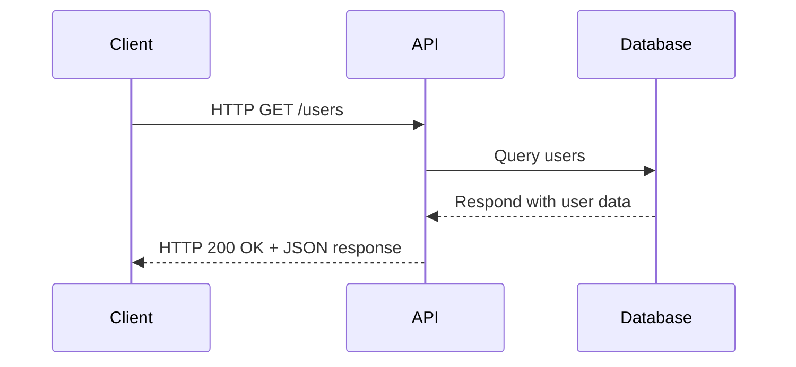

# 3. REST API (Representational State Transfer Application Programming Interface)

## What is a REST API?

- **Definition**: A REST API is a set of rules and conventions for building and interacting with web services using the **REST architectural style**.
- **Key Features**:
  - Stateless communication between client and server.
  - Resource representation (e.g., JSON or XML) for data exchange.
  - Use of HTTP methods (GET, POST, PUT, DELETE) to perform operations on resources.
- **Format**: Often uses **JSON** or **XML** for structured data exchange.
- **Endpoints**: URL paths that map to specific resources (e.g., `/users`, `/orders`).

---

## Why is a REST API Important?

1. **Scalability**:
   - REST APIs are stateless, making them easy to scale horizontally.
2. **Flexibility**:
   - Allows clients to interact with servers across different platforms.
3. **Interoperability**:
   - Enables integration between systems written in different languages.
4. **Standardization**:
   - Leverages standard HTTP methods and status codes for communication.
5. **Ease of Use**:
   - Simplifies communication for both developers and systems by using HTTP.

---

## Where Does a REST API Operate?

- **Client-Server Architecture**:
  - **Client**: Mobile apps, web browsers, or other services that consume the API.
  - **Server**: A backend service exposing REST endpoints.
- **Common Applications**:
  - Web apps, mobile apps, IoT devices, and third-party integrations.
- **Industries**:
  - E-commerce, social media, fintech, healthcare, and more.

---

## When is a REST API Used?

- **Building Web Services**:
  - Used for creating APIs for apps and services.
- **Integration Between Systems**:
  - For example, integrating payment gateways like Stripe or PayPal.
- **Data Sharing**:
  - Exposing or consuming APIs for data exchange.
- **Microservices Architecture**:
  - Enabling communication between microservices.

---

## How Does a REST API Work?

### Key Concepts:

1. **Resources**:
   - Data entities (e.g., `users`, `products`) are exposed via URLs.
   - Example: `/users` represents all users, `/users/1` represents a specific user.

2. **HTTP Methods**:
   - **GET**: Retrieve a resource.
   - **POST**: Create a resource.
   - **PUT**: Update a resource.
   - **DELETE**: Remove a resource.

3. **Stateless Communication**:
   - Each request is independent; no client data is stored on the server.

4. **HTTP Status Codes**:
   - **200 OK**: Request succeeded.
   - **201 Created**: Resource created.
   - **404 Not Found**: Resource not found.
   - **500 Internal Server Error**: Server error.

5. **Request and Response**:
   - **Request**: Contains method, headers, URL, and optional body.
   - **Response**: Contains status code, headers, and body.

---

## Scenario: Using a REST API in a Web Application

### Example: Fetching User Data

You want to fetch a list of users in a web application.

1. **Request**:
   - The frontend sends an HTTP `GET` request to the API endpoint `/users`.
   - Request Example:
     ```
     GET /users HTTP/1.1
     Host: api.example.com
     ```
2. **Processing**:
   - The server processes the request and retrieves the data from the database.
3. **Response**:
   - The server responds with the list of users in JSON format.
   - Response Example:
     ```json
     {
       "users": [
         { "id": 1, "name": "Alice" },
         { "id": 2, "name": "Bob" }
       ]
     }
     ```

---

## Visualization: REST API Flow


---
# Express.js To-Do API Example

This code sets up a simple Express.js server that provides a CRUD (Create, Read, Update, Delete) API for managing a list of to-do items.

## Key Features
1. **Server Setup**: Listens on port 3000.
2. **Hello World Endpoint**: Responds to all requests on `/` with "Hello, World!".
3. **To-Do API**:
   - Retrieve all to-dos
   - Add a new to-do
   - Update an existing to-do
   - Delete a to-do

---

## Code Explanation

### Imports and Initial Setup
```javascript
import express from "express";
import bodyParser from "body-parser";

const app = express();
app.use(bodyParser.json());
```
- **express**: Framework for creating the server and handling routes.
- **body-parser**: Middleware to parse JSON data from the request body. Converts raw JSON into JavaScript objects.

### Root Route ("/")
```javascript
app.all("/", (req, resp) => {
  console.log("Just got a request!", req);
  console.log("Just got a response!", resp);
  resp.send("Hello, World!");
});
```
- Responds to any HTTP method (`GET`, `POST`, etc.) with "Hello, World!".
- Logs the request and response objects to the console.

### To-Do Data
```javascript
const todos = [
  { id: "1", title: "task", complted: true },
  { id: "2", title: "task2", complted: false },
];
```
- Initial list of to-do items with `id`, `title`, and `complted` properties.

### CRUD Operations
#### 1. **Read To-Dos**
```javascript
app.get("/todos", (req, resp) => {
  resp.json(todos);
});
```
- **Endpoint**: `GET /todos`
- Returns the list of all to-dos in JSON format.

#### 2. **Create To-Do**
```javascript
app.post("/todos", (req, resp) => {
  const newTodo = req.body;
  todos.push(newTodo);
  resp.status(201).json({
    message: "new todo added",
  });
});
```
- **Endpoint**: `POST /todos`
- Accepts a new to-do object from the request body and adds it to the list.
- Responds with a `201 Created` status and a success message.

#### 3. **Update To-Do**
```javascript
app.put("/todos/:id", (req, resp) => {
  const newTodoData = req.body;
  const todoParamID = req.params.id;
  const todoIndex = todos.findIndex((todo) => todo.id === todoParamID);
  if (todoIndex !== -1) {
    todos[todoIndex] = {
      id: todoParamID,
      ...newTodoData,
    };
    resp.json({
      message: "Todo Updated Successfully",
    });
  } else {
    resp.status(404).json({
      message: "Todo Not Found",
    });
  }
});
```
- **Endpoint**: `PUT /todos/:id`
- Finds a to-do by its `id` parameter, updates it with new data from the request body.
- Responds with a success message or `404 Not Found` if the to-do doesn't exist.

#### 4. **Delete To-Do**
```javascript
app.delete("/todos/:id", (req, resp) => {
  const todoParamID = req.params.id;
  const todoIndex = todos.findIndex((todo) => todo.id === todoParamID);
  if (todoIndex !== -1) {
    todos.splice(todoIndex, 1);
  }
  resp.json({
    message: "Todo Deleted Successfully",
  });
});
```
- **Endpoint**: `DELETE /todos/:id`
- Finds and removes a to-do by its `id` parameter.
- Responds with a success message (even if the to-do was already deleted).

### Starting the Server
```javascript
const PORT = 3000;
app.listen(PORT, () => {
  console.log(`Server is running on port ${PORT}`);
});
```
- Starts the server on port 3000 and logs a message to confirm it is running.

---

## Example Usage
### Endpoints
1. `GET /todos`: Get all to-dos.
2. `POST /todos`: Add a new to-do (requires JSON in the request body).
3. `PUT /todos/:id`: Update an existing to-do by ID (requires JSON in the request body).
4. `DELETE /todos/:id`: Delete a to-do by ID.

### Sample Data
- Add a new to-do:
  ```json
  {
    "id": "3",
    "title": "New Task",
    "complted": false
  }
  ```
- Update an existing to-do:
  ```json
  {
    "title": "Updated Task",
    "complted": true
  }
  
